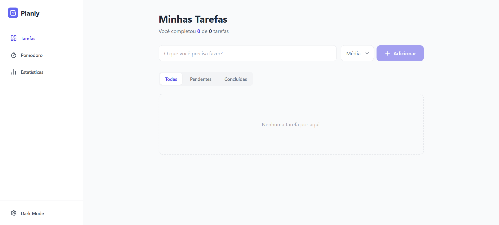

# Planly - Domine seu Tempo

[](https://planly-lovat.vercel.app/)


> Um dashboard que une gestão de tarefas, foco utilizando o método Pomodoro e análise de dados para aumentar a produtividade.



## Sobre o Projeto

O **Planly** foi criado como um projeto de portfólio com o objetivo de colocar em prática e demonstrar conhecimentos em arquitetura Front-end utilizando React e TypeScript. 

Diferente de uma lista de tarefas tradicional, o Planly funciona como uma espécie de “sistema operacional pessoal”, salvando os dados localmente e mostrando o desempenho do usuário por meio de gráficos e indicadores (KPIs). Durante o desenvolvimento, o principal foco foi escrever um código organizado e reutilizável, além de criar uma experiência de uso simples, intuitiva e fluida.

## Funcionalidades

### 1. Gestão de Tarefas (Principal)
- [x] **CRUD Completo:** É possível criar, visualizar, editar e excluir tarefas.
- [x] **Priorização das Tarefas:** As tarefas podem ser marcadas como alta, média ou baixa prioridade, com cores para facilitar a visualização.
- [x] **Filtros em Tempo Real:** Permite alternar rapidamente entre todas as tarefas, pendentes ou concluídas.
- [x] **Salvamento dos Dados:** As informações ficam salvas no LocalStorage, evitando a perda de dados ao atualizar a página.

### 2. Módulo de Foco (Pomodoro)
- [x] **Timer Integrado:** Cronômetro embutido no sistema, sem necessidade de usar aplicativos externos.
- [x] **Modos de Foco e Pausa:** Possibilidade de alternar entre foco, pausa curta e pausa longa.
- [x] **Acompanhamento do Progresso:** Exibe visualmente o andamento do tempo por meio de um indicador animado.

### 3. Dashboard e Análises
- [x] **Gráfico Semanal:** Mostra a produtividade dos últimos 7 dias.
- [x] **Indicadores principais (KPIs):** Cards com informações sobre tarefas concluídas e prioridades.
- [x] **Organização por datas:** As tarefas são agrupadas corretamente de acordo com o dia em que foram finalizadas.

### 4. Interface e Design
- [x] **Modo Escuro:** Opção de tema escuro, com suporte às configurações do sistema.
- [x] **Layout Responsivo:** A interface se adapta bem tanto no celular quanto no computador.
- [x] **Micro-interações:** Pequenas animações e efeitos visuais para melhorar a experiência do usuário.

## Tecnologias Utilizadas

* **Base do Projeto:** React com Vite e TypeScript
* **Estilização:** Tailwind CSS
* **Ícones:** Lucide React
* **Gráficos:** Recharts
* **Manipulação de Datas:** Date-fns
* **Deploy:** Vercel

## Aprendizados Técnicos

Com o desenvolvimento deste projeto, foi possível reforçar e aprender melhor alguns conceitos importantes do React e do desenvolvimento front-end em geral:

1.  **Custom Hooks:** Criação de Hooks próprios, como (`useTodos`, `usePomodoro`) para organizar a lógica da aplicação e manter os componentes mais limpos.
2.  **Derived State:** Uso de cálculos em tempo real para filtros e estatísticas, evitando guardar informações repetidas no estado.
3.  **TypeScript:** Aplicação de tipagem mais rígida para aumentar a segurança na troca de dados entre os componentes.
4.  **Imutabilidade:** Manipulação correta de listas e objetos no estado do React, evitando alterações diretas.
5.  **Clean Code:** Estrutura de pastas bem definida e separação de responsabilidades para facilitar a manutenção e evolução do projeto.

## Como rodar localmente

Clone o projeto e instale as dependências:

```bash
# Clone o repositório
git clone [https://github.com/seu-usuario/planly.git](https://github.com/GislaineMendonca/planly.git)

# Entre na pasta
cd planly

# Instale as dependências
npm install

# Rode o servidor de desenvolvimento
npm run dev
